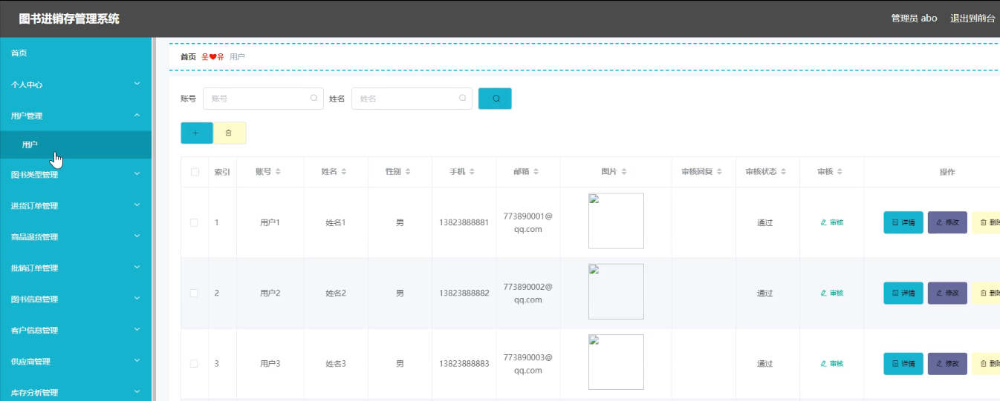
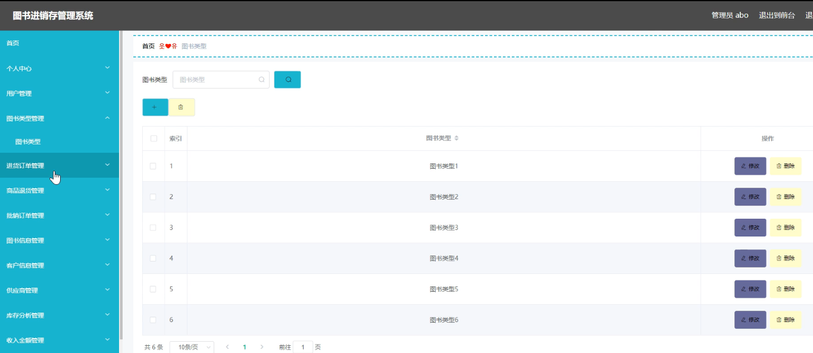
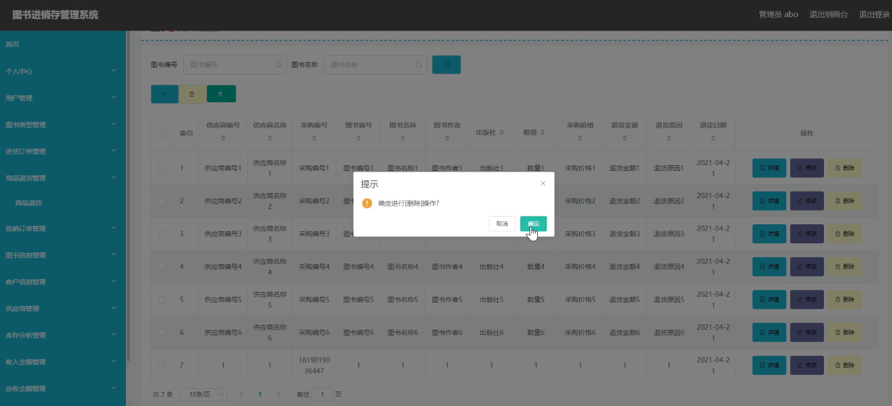
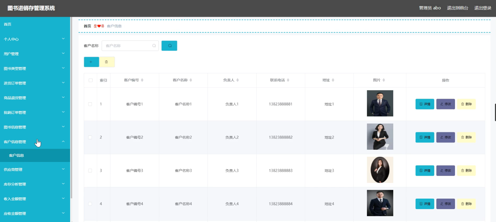
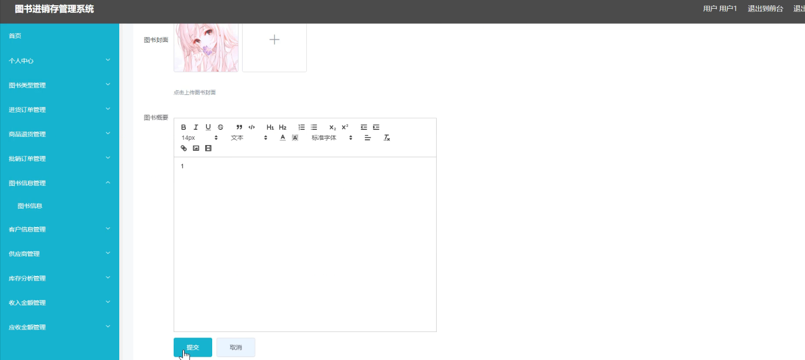
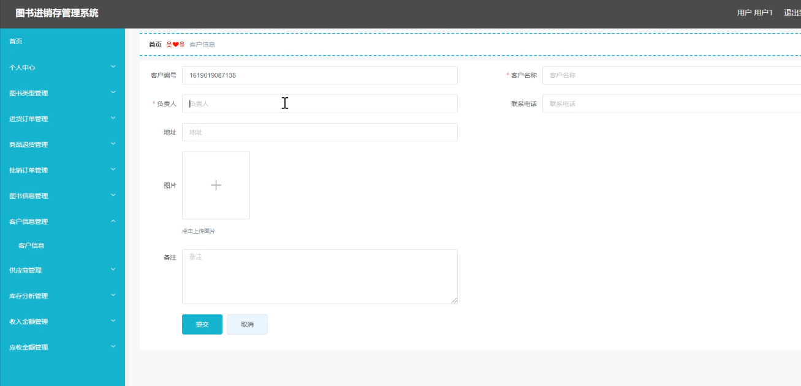
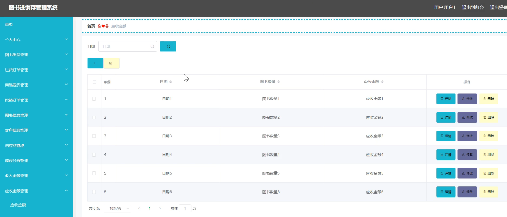

**项目简介：**  
本项目基于主流的前后端分离架构，采用 **SpringBoot + Vue 技术栈**，配套 **MySQL 数据库**，适用于毕业设计与课题实训开发。  
本人已整理了超 **4000 多套毕业设计源码+论文+开题报告+PPT...**，涵盖 **Java、SpringBoot、Vue、SSM、uni-app 小程序、PHP、Android** 等方向，支持功能修改定制与论文服务。  
**团队提供以下服务：**  
- 项目代码修改与调试  
- 数据库配置与远程协助  
- 论文定制与修改  
**获取更多的4000多套源码或SQL文件请联系：**  
- QQ：3906443360 微信：BesheHelp

# springboot071基于springboot的图书进销存管理系统

（1）图书类型信息的实体属性图如下：

图4.12  图书类型信息实体属性图

（2）收入金额信息实体属性图如图4.13所示：

图4.13  收入金额信息实体属性图

（3）管理员信息实体属性图如图4.14所示：

图4.14 管理员信息实体属性图

4.3.2数据库设计表

图书进销存管理系统需要后台数据库，下面介绍数据库中的各个表的详细信息：

表4.1 图书信息评论表

表4.2 供应商

表4.3 进货订单

表4.4 客户信息

表4.5 库存分析

表4.6 批销订单

表4.7 商品退货

表4.8 收入金额

表4.9 收藏表

表4.10 图书类型

表4.11 图书信息

表4.12 管理员表

表4.13 应收金额

表4.14 用户

5系统详细实现

5.1 用户信息管理

图书进销存管理系统的系统管理员可以管理用户，可以对用户信息添加修改删除以及查询操作。具体界面的展示如图5.1所示。

图5.1 用户信息管理界面

5.2 图书类型管理

系统管理员可以查看对图书类型进行添加，修改，删除以及查询操作。具体界面如图5.2所示。

图5.2 图书类型管理界面

5.3 商品退货管理

管理员可以对商品退货进行添加，修改，删除以及查询操作。界面如下图所示：

图5.3 商品退货管理界面

5.4 客户信息管理

管理员可以对客户信息信息进行添加修改删除操作。界面如下图所示：

图5.4 客户信息界面

5.5 图书添加

用户可以对图书信息进行添加。界面如下图所示：

图5.5 图书添加界面

5.6 客户添加

用户可以对客户信息进行添加。界面如下图所示：

图5.6 客户添加界面

5.7 应收金额

用户可以对应收金额进行添加修改删除操作。界面如下图所示：

图5.7 应收金额界面